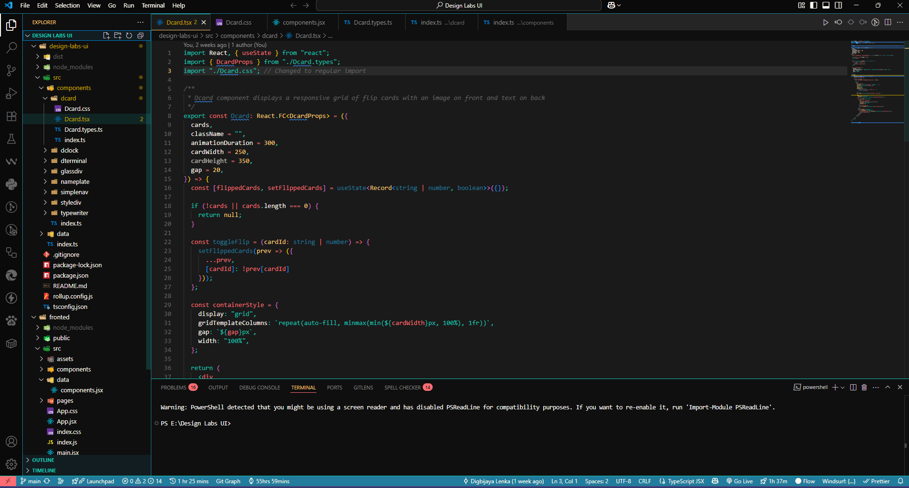

# Dreamy Lights Theme

A soft and vibrant VS Code theme featuring dreamy coral, teal, and golden lights designed for developers who love beautiful, eye-friendly coding environments.

## Preview

## Features

✨ **Soft on the eyes** - Carefully chosen colors for reduced eye strain  
🎨 **Beautiful syntax highlighting** - Optimized for JavaScript, TypeScript, React, and CSS  
🌊 **Dreamy color palette** - Coral pinks, ocean teals, and golden accents  
🔥 **Perfect for MERN stack** - Great contrast for MongoDB, Express, React, Node.js  

## Installation

1. Open VS Code
2. Go to Extensions (Ctrl+Shift+X)
3. Search for "Dreamy Lights"
4. Click Install
5. Go to File > Preferences > Color Theme
6. Select "Dreamy Lights"

## Color Palette

- 🪸 **Coral**: #FE6D73
- 🌟 **Cream**: #FEF9EF  
- ✨ **Golden**: #FFCB77
- 🌊 **Teal**: #17C3B2
- 🫧 **Ocean Blue**: #227C9D

## Perfect For

- JavaScript & TypeScript development
- React & Node.js projects
- CSS & SCSS styling
- JSON configuration files
- Markdown documentation
- Long coding sessions

## Contributing

Love the theme? Found a bug? Feel free to open issues or submit pull requests!

## License

MIT License - feel free to modify and share!